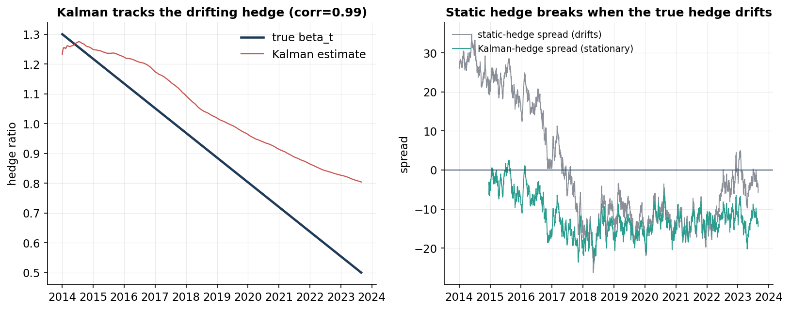
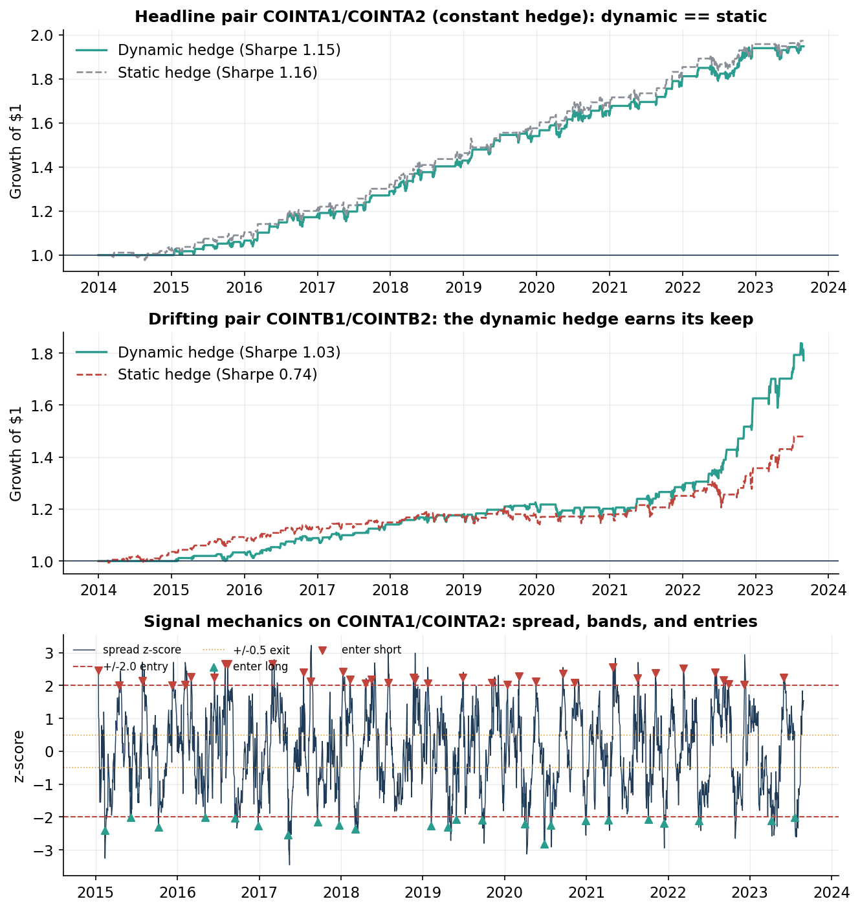
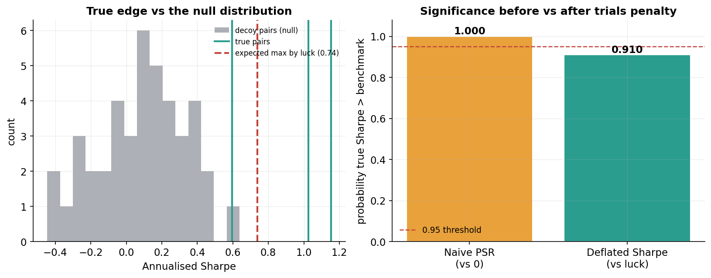
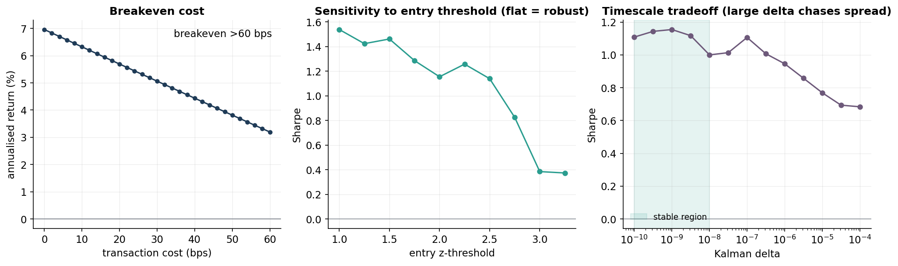
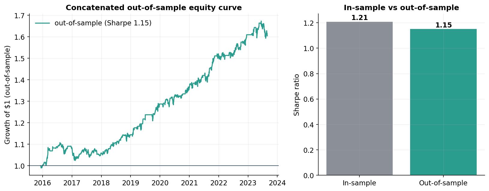

# Statistical-Arbitrage Pairs Trading

A cointegration-based pairs-trading strategy built around a single question:
**is the backtested edge real, or an artefact of overfitting and multiple
testing?** The strategy itself (Kalman-filtered dynamic hedge ratios,
Ornstein–Uhlenbeck spread modeling, z-score mean-reversion signals) is
standard. What makes this project worth reading is the evaluation stack wrapped
around it: every result is validated against known ground truth, corrected for
the number of pairs searched, charged realistic transaction costs, and selected
out-of-sample.

---

## The idea in one paragraph

Two assets are *cointegrated* if some linear combination of their (individually
random-walking) prices is stationary — a spread that keeps reverting to a mean.
When the spread stretches unusually far, you bet on it snapping back: short the
rich leg, long the cheap one, and unwind as it reverts. The hard parts are not
the trade but the honesty: estimating the hedge ratio without peeking at the
future, and deciding whether an edge that survived a search over many pairs is
actually there.

---

## Validate against known truth first

The demonstration runs on a **synthetic universe with known ground truth**:
three genuinely cointegrated pairs — one with a deliberately *time-varying*
hedge ratio — hidden among independent random-walk decoys. Because the truth is
known, every method can be checked: does the cointegration test find the true
pairs? does the Kalman filter recover the true drifting hedge? does the OU fit
recover the true half-life? This is the same logic as validating a Monte Carlo
pricer against a closed-form price — a method you cannot check against a known
answer is a method you cannot trust. The identical pipeline then runs on real
equities through the included `yfinance` loader (see *Running on real data*).



| Recovery check | Truth | Recovered |
|---|---|---|
| Most-cointegrated pair (Engle–Granger *p*) | true pair | `COINTA` at *p* = 1.7 × 10⁻¹³ |
| True pairs ranked in top 3 (of 45) | 3 | 2 (the drifting pair ranks lower — see below) |
| Time-varying hedge ratio (corr. with truth) | drifts 1.30 → 0.50 | **corr = 0.99** |
| OU half-life, pair `COINTA` | 10 days | 11.0 days |
| OU half-life, pair `COINTC` | 30 days | 31.5 days |
| OU half-life, pair `COINTB` (drifting) | — | **non-stationary under a static hedge** (ADF *p* = 0.32) |

That last row is the key one: when the true hedge ratio drifts, a *static* hedge
leaves a non-stationary residual — the spread trends instead of reverting, and
the trade breaks. That is exactly what motivates estimating the hedge
dynamically. (The Kalman estimate tracks the drift's shape at 0.99 correlation
with a mild lag characteristic of the smoother; what matters for trading is that
the resulting spread is stationary, shown on the right above.)

---

## The strategy, with an honest benchmark

The full pipeline — Kalman dynamic hedge → causal spread → rolling z-score
signal → backtest with costs — is run on the most cointegrated pair, and
benchmarked against the naive static-hedge version so the value of the
sophistication is measured rather than assumed.



| Pair | Hedge | Sharpe | Sortino | Ann. return | Max DD |
|---|---|---:|---:|---:|---:|
| `COINTA` (constant hedge) | Dynamic (Kalman) | 1.15 | 1.12 | 6.9% | −5.0% |
| `COINTA` (constant hedge) | Static (OLS) | 1.16 | 1.17 | 7.0% | −4.7% |
| `COINTB` (drifting hedge) | Dynamic (Kalman) | **1.03** | 0.82 | 5.9% | −6.6% |
| `COINTB` (drifting hedge) | Static (OLS) | 0.74 | 0.63 | 4.0% | −7.6% |

The honest reading: on the constant-hedge pair the dynamic hedge is a **wash**
(−0.01 Sharpe — as it should be, since there is nothing to track). On the
drifting pair it adds **+0.29 Sharpe**. Because you cannot know *ex ante* which
pairs will drift, the dynamic hedge is the robust default: a negligible premium
on stable pairs buys a large gain on drifting ones. (All Sharpes are net of 1 bp
per-trade transaction costs.)

---

## Not fooling yourself: the multiple-testing correction

This is the core of the project. The best pair's Sharpe of 1.15 looks
compelling — but it is the *winner of a search over 45 pairs*, and with enough
candidates something looks good by luck. Two corrections address this:

- **Deflated Sharpe Ratio** (Bailey & López de Prado): given the number of pairs
  tested and the spread of their Sharpes, compute the Sharpe the *best of that
  many zero-skill strategies* would reach by luck, and ask whether the observed
  Sharpe beats it — adjusting for track length, skew, and kurtosis.
- **Permutation / placebo test**: trade every decoy pair with the identical
  pipeline to build the null distribution of Sharpes achievable by luck, then
  locate the true pair within it.



| Measure | Value | Reading |
|---|---:|---|
| Pairs tested (trials) | 45 | the source of selection bias |
| Best annualised Sharpe | 1.15 | before any correction |
| Expected max Sharpe by luck | 0.74 | what the best of 45 zero-skill trials clears |
| **Naive PSR vs 0** (no penalty) | **1.000** | looks near-certain… |
| **Deflated Sharpe** (vs luck) | **0.910** | …until the trials penalty is applied |
| Permutation *p*-value | **< 0.001** | true pair beats every decoy |

The naive probabilistic Sharpe says the edge is near-certain — but that ignores
that it won a 45-way search. The deflated Sharpe applies the trials penalty and
pulls the confidence down to 0.91, just under the conventional 0.95 bar:
**borderline**. Meanwhile the permutation test independently confirms the true
pair beats every decoy (*p* < 0.001). Taken together: an edge that is real but
**modest**, reported honestly rather than inflated by the selection that found
it. A suspiciously clean Sharpe would be the warning sign; this is what an
honest one looks like.

---

## Robustness: costs and parameter sensitivity



- **Breakeven transaction cost > 60 bps.** The edge survives well beyond
  realistic costs for liquid names (~1–5 bps), because the strategy trades
  patiently (~120 round trips over nine years) rather than constantly.
- **Flat sensitivity to the entry threshold** (Sharpe 1.14–1.46 across entries
  from 1.5σ to 2.5σ): a broad plateau, not a knife-edge fit.
- **The Kalman `delta` exposes a genuine tradeoff.** Too large, and the hedge
  chases — and absorbs — the very mean-reversion signal it should leave intact;
  the default sits in the stable region where the hedge tracks only slow
  structural drift. This is the bias/variance dial of the whole approach, shown
  explicitly rather than hidden.

---

## Out-of-sample selection (walk-forward)

The deadliest bias in a pairs backtest is choosing the pair on the same data
used to score it. Here selection is made **out of sample**: on each roll, pairs
are chosen using only a past 504-day formation window, then traded — untouched —
over the following 126-day window. Concatenating those untouched windows gives
an honest track record.



| | Sharpe | Ann. return | Max DD |
|---|---:|---:|---:|
| In-sample (selected pairs) | 1.21 | — | — |
| **Out-of-sample (never seen)** | **1.15** | 6.1% | −7.4% |

The out-of-sample Sharpe (1.15) barely differs from in-sample (1.21). A large
in-sample/out-of-sample gap is the classic signature of overfitting; its near-
absence here means the selection **generalises** rather than curve-fitting the
sample.

---

## Methods and math

**Cointegration.** Correlation is not enough — two series can be highly
correlated yet drift apart forever. The pipeline tests for cointegration
directly, with both the Engle–Granger two-step test (regress, then ADF-test the
residual for stationarity) and the symmetric, systems-based Johansen trace test.

**Dynamic hedge ratio (Kalman filter).** The hedge ratio is estimated *online*
as a scalar linear Gaussian state-space model, updated each day using only past
data:

```
state:        hedge_t = hedge_{t-1} + w_t,     w_t ~ N(0, Q)
observation:  A_t     = hedge_t · B_t + v_t,   v_t ~ N(0, R)
```

Because the random-walk state prediction is just `hedge_{t-1}`, the one-step
forecast error `e_t = A_t − hedge_{t-1}·B_t` is the causal, tradeable spread —
no lookahead. `Q = δ/(1−δ)` sets how fast the hedge may move; `δ` is kept small
so the hedge tracks slow structural drift without chasing the fast spread. The
intercept is omitted (it creates a hedge/level collinearity that destabilises
the estimate); the spread's mean is handled by the rolling standardisation.

**Spread modeling (Ornstein–Uhlenbeck).** The spread is modelled as a
mean-reverting OU process, `ds = κ(μ − s)dt + σ dW`, fit via its exact discrete
AR(1) equivalent. Its half-life `ln 2 / κ` is the natural holding period and
sets the timescale for the signal.

**Signal and backtest.** A causal rolling z-score of the spread drives a
stateful mean-reversion rule (enter at ±2σ, exit at ±0.5σ). The backtest is
explicitly causal — every quantity deciding day *t*'s PnL is known at *t−1* —
and charges transaction costs on turnover. Returns are expressed on gross
capital deployed, so the Sharpe is that of a self-financing dollar-neutral book.

**Multiple-testing correction.** The Probabilistic and Deflated Sharpe Ratios
(with skew/kurtosis adjustment) and a permutation test against the decoy null,
as described above.

---

## Repository structure

```
statarb-pairs-trading/
├── src/
│   ├── data.py           # synthetic universe (known truth) + yfinance loader
│   ├── cointegration.py  # Engle–Granger & Johansen tests, pair screener
│   ├── kalman.py         # dynamic hedge-ratio filter (state-space)
│   ├── ou.py             # Ornstein–Uhlenbeck fit, half-life
│   ├── signals.py        # rolling z-score, entry/exit position logic
│   ├── backtest.py       # causal PnL, costs, turnover
│   ├── metrics.py        # Sharpe/Sortino/drawdown + PSR & Deflated Sharpe
│   └── selection.py      # walk-forward out-of-sample selection
├── experiments/
│   ├── config.py             # shared parameters, seed, plot style
│   ├── run_validation.py     # recover known ground truth
│   ├── run_strategy.py       # full backtest + static-hedge benchmark
│   ├── run_multiple_testing.py  # deflated Sharpe + permutation test
│   ├── run_robustness.py     # breakeven cost + parameter sensitivity
│   └── run_walkforward.py    # out-of-sample selection
├── tests/
│   └── test_pipeline.py  # ground-truth recovery + lookahead checks
├── figures/              # generated figures
└── results/              # generated text summaries
```

## Usage

```bash
pip install -r requirements.txt

# reproduce every figure and results table
python experiments/run_validation.py
python experiments/run_strategy.py
python experiments/run_multiple_testing.py
python experiments/run_robustness.py
python experiments/run_walkforward.py

# run the test suite (ground-truth recovery + no-lookahead checks)
pytest -q
```

## Running on real data

The demonstration is self-contained (synthetic data, no network needed), but the
pipeline is built to run unchanged on real prices. `src/data.py` includes a
`yfinance` loader:

```python
from src.data import load_prices_yfinance
from src.cointegration import screen_pairs

# e.g. energy-sector ETF candidates
prices = load_prices_yfinance(["XLE", "XOP", "VDE", "OIH", "IEO"],
                              start="2015-01-01", end="2024-12-31")
screen = screen_pairs(prices)          # then feed selected pairs to the pipeline
```

Everything downstream — the Kalman hedge, OU fit, signals, backtest, and the
deflated-Sharpe evaluation — operates identically on a real price panel.

## References

- Bailey, D. & López de Prado, M. (2014). *The Deflated Sharpe Ratio: Correcting
  for Selection Bias, Backtest Overfitting, and Non-Normality.* Journal of
  Portfolio Management.
- Engle, R. & Granger, C. (1987). *Co-integration and Error Correction.*
  Econometrica.
- Johansen, S. (1991). *Estimation and Hypothesis Testing of Cointegration
  Vectors in Gaussian Vector Autoregressive Models.* Econometrica.
- Chan, E. (2013). *Algorithmic Trading: Winning Strategies and Their
  Rationale.* Wiley. (Kalman-filter pairs approach.)
- Vidyamurthy, G. (2004). *Pairs Trading: Quantitative Methods and Analysis.*
  Wiley.

---

*Demonstration uses synthetic data with known ground truth so every method can
be validated against a known answer; the identical pipeline runs on real
equities via the included loader. Performance figures are illustrative of the
methodology, not a live track record.*
